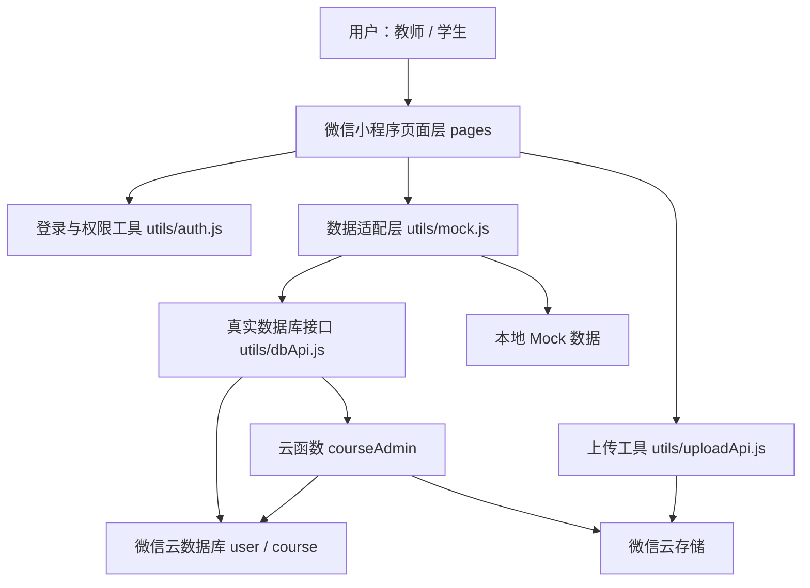
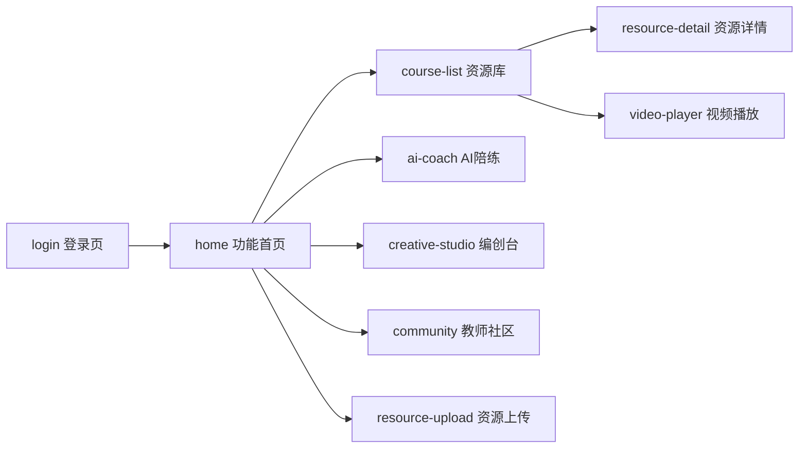
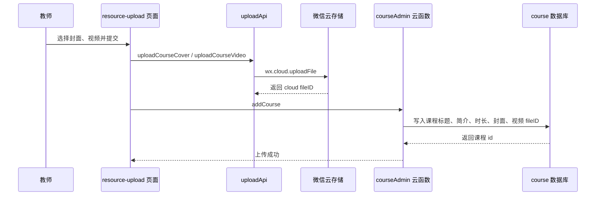

# 舞蹈课堂微信小程序技术文档

## 1. 项目概述

本项目是一个面向小学舞蹈课堂的微信小程序，定位为“舞蹈课堂数字助教”。系统围绕教师备课、学生学习、动作陪练、舞蹈编创和教研交流五类场景展开，重点解决乡村小学舞蹈教学中资源组织难、非专业教师备课压力大、学生动作练习反馈弱、课堂创作展示不足等问题。

当前版本属于答辩演示版本，已经具备完整的小程序页面、师生角色区分、本地 Mock 数据、部分微信云开发能力和可演示交互。课程视频、资源上传和编创视频临时链接使用微信云开发能力；AI 动作识别、社区发布和部分资源记录目前采用本地模拟方式实现。

## 2. 项目目标

- 建立教师和学生共用的舞蹈课堂入口。
- 教师端支持备课资源查看、课程资源上传、AI 陪练演示、编创片段生成和教师社区发布。
- 学生端支持课程学习、AI 跟练、创意编创和社区浏览。
- 将龙胜小学、龙胜二小苗族舞蹈课程大纲和分年级教案整理为小程序资源。
- 为后续接入真实数据库、文件存储、姿态识别服务保留清晰接口。

## 3. 技术选型

| 类型 | 技术 |
| --- | --- |
| 客户端框架 | 原生微信小程序 |
| 页面结构 | WXML |
| 页面样式 | WXSS |
| 业务逻辑 | JavaScript |
| 配置文件 | JSON |
| 本地状态 | `wx.setStorageSync` / `wx.getStorageSync` |
| 云能力 | 微信云开发、云数据库、云存储、云函数 |
| 数据适配 | `utils/mock.js` 统一封装前端数据调用 |
| 文件上传 | `wx.cloud.uploadFile` |
| 视频播放 | 微信原生 `<video>` 组件 |

## 4. 系统架构

系统采用“页面层 + 工具层 + 数据适配层 + 云开发能力”的结构。



设计重点是让页面不直接依赖具体数据来源。页面统一调用 `utils/mock.js` 或工具层方法，后续从 Mock 切换为真实后端时，可以优先替换数据适配层，减少页面改动。

## 5. 项目目录

```text
dance/
├── app.js                         # 小程序启动入口，初始化云开发和登录状态
├── app.json                       # 页面注册和窗口配置
├── app.wxss                       # 全局样式
├── README.md                      # 项目使用说明
├── TECHNICAL_DOCUMENT.md          # 答辩技术文档
├── assets/
│   └── docs/                      # 已加入的 Word 教学资料原件
├── cloudfunctions/
│   └── courseAdmin/               # 课程管理云函数
├── pages/
│   ├── login/                     # 登录页
│   ├── home/                      # 师生功能首页
│   ├── course-list/               # 资源库 / 课程学习
│   ├── resource-detail/           # 教案、课件详情
│   ├── video-player/              # 视频播放页
│   ├── ai-coach/                  # AI 动作陪练演示
│   ├── creative-studio/           # 创意编创台
│   ├── community/                 # 教师社区
│   └── resource-upload/           # 教师资源上传
└── utils/
    ├── auth.js                    # 登录状态和本地缓存封装
    ├── mock.js                    # 数据适配层和演示数据
    ├── dbApi.js                   # 云数据库接口
    ├── uploadApi.js               # 云存储上传接口
    ├── uploadBatch.js             # 批量上传辅助类
    └── util.js                    # 通用工具
```

## 6. 页面路由设计

页面注册在 `app.json` 中：

```text
pages/login/login
pages/home/home
pages/course-list/course-list
pages/resource-detail/resource-detail
pages/video-player/video-player
pages/ai-coach/ai-coach
pages/creative-studio/creative-studio
pages/community/community
pages/resource-upload/resource-upload
```

核心跳转关系：



## 7. 用户角色与权限

系统区分学生和教师两类角色。

| 角色 | 登录账号示例 | 主要权限 |
| --- | --- | --- |
| 学生 | `2024001 / 123456` | 课程学习、AI 跟练、编创作品保存、浏览教师社区 |
| 教师 | `T1001 / 123456` | 备课资源库、资源上传、AI 陪练、编创片段、社区发布 |

登录流程：

1. 用户在登录页选择学生或教师角色。
2. 输入账号和密码。
3. `pages/login/login.js` 调用 `mock.login(account, password, role)`。
4. 登录成功后调用 `auth.setLoginInfo(userInfo)` 写入本地缓存。
5. 使用 `wx.reLaunch` 跳转到 `pages/home/home`。
6. 首页根据 `userInfo.role` 渲染不同功能入口和文案。

本地缓存 key：

```text
dance_student_token
dance_student_info
dance_used_resources
dance_creative_pieces
dance_local_posts
```

## 8. 功能模块设计

### 8.1 登录模块

位置：`pages/login/`

功能：

- 支持学生和教师角色切换。
- 学生使用学号登录，教师使用工号登录。
- 输入为空时进行前端校验。
- 登录成功后保存本地登录状态。
- 登录失败时展示错误提示。

技术点：

- 使用 `setData` 维护账号、密码、角色和 loading 状态。
- 使用 `auth.js` 封装缓存读写，避免页面直接操作缓存。
- 使用 `wx.reLaunch` 防止登录后返回登录页。

### 8.2 首页模块

位置：`pages/home/`

功能：

- 教师端展示备课资源库、AI 动作陪练、创意编创台、教师社区、资源上传。
- 学生端展示课程学习、AI 动作陪练、创意编创台、教师社区浏览。
- 支持退出登录。

技术点：

- 通过 `auth.getUserInfo()` 获取当前用户。
- 根据 `role` 切换 `teacherFeatures` 或 `studentFeatures`。
- 功能卡片使用 `wx.navigateTo` 跳转到对应页面。

### 8.3 备课资源库 / 课程学习模块

位置：`pages/course-list/`

功能：

- 展示标准教案、分解视频和课件模板。
- 支持“全部、教案、分解视频、课件模板”分类筛选。
- 支持关键词搜索。
- 视频资源进入视频播放页。
- 教案和课件资源进入资源详情页。
- 一键调用资源，写入本地缓存。

数据来源：

- 云数据库课程数据：`course` 集合。
- 本地补充资源：`utils/mock.js` 中的 `localResourceExtras` 和 `teachingResources`。
- 已加入的 Word 原件：`assets/docs/`。

### 8.4 资源详情模块

位置：`pages/resource-detail/`

功能：

- 展示资源标题、标签、简介。
- 展示教学资料的结构化章节。
- 支持加入备课记录或学习记录。

本次已加入的教学资料：

- 龙胜小学苗族舞蹈技术技巧课程大纲 2.0
- 一、二年级第二节课：小摆手与颤膝配合
- 三、四年级第一节课：颤膝与松弛发力
- 三、四年级第二节课：屈伸律动与上肢摆动
- 五、六年级第一节课：复合动律与微短句
- 五、六年级第二节课：复合步伐与转身技巧

实现方式：

- Word 原件保存到 `assets/docs/`。
- 核心内容整理为 `teachingResources` 数组。
- 详情页读取 `resource.sections` 并按章节渲染。

### 8.5 视频播放模块

位置：`pages/video-player/`

功能：

- 根据课程 id 获取课程详情。
- 使用微信原生 `<video>` 组件播放视频。
- 展示标题、时长和简介。

技术点：

- `getCourseDetail(courseId)` 内部兼容字符串和数字 id。
- 云存储视频需要通过 `wx.cloud.getTempFileURL` 转为临时 HTTPS 地址后播放。
- 本地演示视频可直接使用 HTTPS 示例地址。

### 8.6 AI 动作陪练模块

位置：`pages/ai-coach/`

功能：

- 展示可选择的动作列表。
- 选择动作后展示参考动作、训练重点。
- 点击开始陪练后模拟检测。
- 返回模拟评分、纠错建议和动作对比结果。

当前实现说明：

- 不调用摄像头。
- 不做真实人体姿态识别。
- 结果来自 `utils/mock.js` 中的 `coachActions`。

后续真实实现可接入：

- 摄像头采集。
- 姿态识别模型。
- 关键点对齐和动作评分算法。
- 教师端训练报告。

### 8.7 创意编创台模块

位置：`pages/creative-studio/`

功能：

- 展示摆臂、踏步、转身、亮相、拍手、俯仰等微律动单元。
- 用户点击动作单元后加入编创序列。
- 根据已选动作自动生成作品名称。
- 点击生成片段后获取云存储中的演示视频临时链接。
- 支持保存作品到本地缓存。

技术点：

- 选择序列保存在页面 `selectedUnits` 中。
- 保存作品调用 `mock.saveCreativePiece(piece)`。
- 生成视频时调用云函数 `courseAdmin` 的 `getTempUrl` 动作。
- 当前答辩版本使用固定云端视频作为生成结果，保证演示稳定。

### 8.8 教师社区模块

位置：`pages/community/`

功能：

- 展示经验分享、远程指导、教研记录。
- 支持分类切换。
- 学生可以浏览。
- 教师可以发布本地模拟帖子。

技术点：

- 社区基础帖子来自 `utils/mock.js`。
- 教师发布内容写入 `dance_local_posts`。
- 学生点击发布时显示权限提示。

### 8.9 资源上传模块

位置：`pages/resource-upload/`

功能：

- 教师选择课程封面和课程视频。
- 上传到微信云存储。
- 通过云函数保存课程记录到云数据库。

权限控制：

- 页面 `onLoad` 检查当前用户角色。
- 非教师用户会提示“仅教师可访问”并返回首页。

上传流程：



## 9. 数据设计

### 9.1 用户数据

本地演示用户位于 `utils/mock.js`：

```js
{
  id: 1,
  account: '2024001',
  password: '123456',
  name: '李同学',
  role: 'student',
  roleName: '学生',
  avatar: ''
}
```

云数据库用户集合：`user`

建议字段：

| 字段 | 含义 |
| --- | --- |
| `_id` | 数据库主键 |
| `userId` | 学号或工号 |
| `password` | 密码，正式版应加密存储 |
| `name` | 用户姓名 |
| `role` | `student` 或 `teacher` |
| `avatarUrl` | 头像地址 |

### 9.2 课程数据

云数据库课程集合：`course`

| 字段 | 含义 |
| --- | --- |
| `_id` | 课程 id |
| `title` | 课程标题 |
| `description` | 课程描述 |
| `duration` | 课程时长 |
| `coverUrl` | 云存储封面 fileID |
| `videoUrl` | 云存储视频 fileID |

前端统一转换为资源卡片结构：

```js
{
  id: course._id,
  type: 'video',
  label: '分解视频',
  title: course.title,
  duration: course.duration,
  videoUrl: course.videoUrl,
  description: course.description,
  tags: []
}
```

### 9.3 教学资源数据

教学资源在 `utils/mock.js` 中以结构化对象维护：

```js
{
  id: 'doc-grade-3-4-lesson-2',
  type: 'lesson',
  label: '标准教案',
  title: '三、四年级第二节课：屈伸律动与上肢摆动',
  duration: '40分钟',
  description: '面向中年级...',
  docFile: '/assets/docs/grade-3-4-lesson-2-flexion-arm-swing.docx',
  tags: ['教案', '三四年级', '屈伸律动', '上肢摆动'],
  sections: [
    { title: '课堂目标', lines: [] },
    { title: '课堂训练', lines: [] }
  ]
}
```

## 10. 数据适配层设计

`utils/mock.js` 是项目的核心数据适配层。页面只调用它导出的方法，不关心数据来自云数据库还是本地 Mock。

主要方法：

| 方法 | 用途 |
| --- | --- |
| `login(account, password, role)` | 登录 |
| `getCourseList()` | 获取视频课程 |
| `getCourseDetail(courseId)` | 获取课程详情 |
| `getResourceList(type, keyword)` | 获取资源库列表 |
| `getResourceDetail(resourceId)` | 获取资源详情 |
| `getCoachActions()` | 获取 AI 陪练动作 |
| `getCoachResult(actionId)` | 获取模拟陪练结果 |
| `getCreativeUnits()` | 获取编创动作单元 |
| `getCommunityPosts(type)` | 获取社区帖子 |
| `useResource(resource)` | 保存资源调用记录 |
| `saveCreativePiece(piece)` | 保存编创作品 |
| `publishCommunityPost(post)` | 发布本地社区内容 |

关键逻辑：

```text
页面调用 mock.js
如果 dbApi 可用并且接口成功：返回云数据库数据
如果 dbApi 不可用或接口失败：回退本地 Mock 数据
```

这样做的好处：

- 答辩演示时即使云数据库不可用，页面仍然能运行。
- 后续正式接后端时，页面层不需要大改。
- Mock 数据和真实数据可以并存，方便渐进式开发。

## 11. 云开发设计

### 11.1 云环境初始化

位置：`app.js`

```js
wx.cloud.init({
  env: 'cloud1-d9gqdwuj082ecda5d',
  traceUser: true
});
```

### 11.2 云数据库接口

位置：`utils/dbApi.js`

已实现能力：

- `login`：查询 `user` 集合并校验角色。
- `getCourseList`：读取 `course` 集合。
- `getCourseDetail`：读取单个课程并转换云存储临时链接。
- `addCourse`：调用云函数新增课程。
- `updateCourse`：调用云函数更新课程。
- `deleteCourse`：调用云函数删除课程。

### 11.3 云函数

位置：`cloudfunctions/courseAdmin/`

云函数动作：

| action | 功能 |
| --- | --- |
| `add` | 新增课程 |
| `update` | 更新课程 |
| `delete` | 删除课程 |
| `getTempUrl` | 将云存储 fileID 转换为临时 HTTPS 链接 |

使用云函数的原因：

- 课程增删改需要更高权限，不应直接暴露给客户端。
- 云函数运行在服务端，可以绕过客户端安全规则完成管理操作。
- 获取临时链接可以统一处理云存储视频播放问题。

## 12. 关键技术难点与解决方案

### 12.1 小程序视频不能直接播放 `cloud://`

问题：微信 `<video>` 组件不能直接播放云存储 `cloud://` 文件 ID。

解决：

- 使用 `wx.cloud.getTempFileURL` 或云函数 `getTempUrl` 转为临时 HTTPS 链接。
- 视频播放页和编创视频生成页均采用临时链接方式。

### 12.2 没有完整数据库时如何保证演示可运行

问题：答辩时网络、云数据库、数据初始化都可能影响演示稳定性。

解决：

- `mock.js` 封装 `withDb(apiCall, fallback)`。
- 云端接口失败时自动回退本地数据。
- 登录、AI 陪练、社区、编创作品使用本地缓存形成闭环。

### 12.3 师生角色页面差异

问题：教师和学生使用同一个入口，但功能和权限不同。

解决：

- 登录时保存 `role` 和 `roleName`。
- 首页根据角色渲染不同功能入口。
- 上传页面和社区发布操作增加角色校验。

### 12.4 Word 教案如何在小程序中展示

问题：小程序不适合直接解析和编辑 Word 文件，直接打开本地包内 docx 也不利于展示。

解决：

- Word 原件放入 `assets/docs/` 保留。
- 将答辩需要展示的核心内容整理为结构化数据。
- 详情页直接渲染章节内容，提高可读性和演示稳定性。

## 13. 测试方案

### 13.1 登录测试

- 学生账号 `2024001 / 123456` 可登录。
- 教师账号 `T1001 / 123456` 可登录。
- 学生账号在教师角色下登录失败。
- 教师账号在学生角色下登录失败。
- 登录后关闭再打开小程序可保持登录状态。

### 13.2 功能测试

- 首页功能卡片可跳转。
- 资源库分类筛选和搜索可用。
- 教案可进入资源详情页。
- 视频课程可进入视频播放页。
- AI 陪练可选择动作并返回模拟评分。
- 编创台可选择动作、生成视频、保存作品。
- 学生不能发布社区内容，教师可以发布。
- 教师可进入资源上传页。

### 13.3 静态检查

当前已执行：

```text
所有 JS 文件通过 node --check
所有 JSON 文件可被 JSON.parse 解析
app.json 中注册页面均具备 js/json/wxml/wxss 四件套
```

## 14. 当前版本边界

当前版本是可演示原型，不是完整生产系统。

已完成：

- 小程序页面闭环。
- 师生角色区分。
- 教学资源库和教案详情。
- 视频课程播放。
- 教师资源上传到云存储。
- 云函数管理课程数据。
- AI 陪练模拟评分。
- 编创视频演示输出。
- 社区本地发布。

暂未完成：

- 真实 AI 姿态识别。
- 多设备同步的社区发布。
- 完整后台管理系统。
- Word/PDF 文件在线预览。
- 正式密码加密和账号安全体系。
- 学生学习进度、教师评价等完整数据模型。

## 15. 后续优化方向

1. 建立完整数据库模型：用户、课程、资源、学习记录、作品、社区帖子、评论。
2. 接入文件预览能力：将 Word 转 PDF 后上传云存储，支持在线预览。
3. 接入真实姿态识别：通过摄像头采集关键点，计算动作相似度。
4. 建设教师后台：支持资源审核、课程维护、学生作品管理。
5. 增加学习报告：统计学生观看、跟练、作品提交和评分趋势。
6. 完善权限系统：区分管理员、教师、学生和游客。
7. 优化云函数：增加参数校验、错误码、日志追踪和安全规则。

## 16. 答辩讲解建议

答辩时可以按以下顺序介绍：

1. 先讲项目背景：乡村小学舞蹈课堂需要数字化辅助。
2. 再讲用户角色：教师备课和学生学习共用一个小程序。
3. 展示整体架构：页面层、工具层、数据适配层、云开发。
4. 演示核心功能：首页、资源库、教案详情、AI 陪练、编创视频、社区。
5. 重点说明技术亮点：数据适配回退、云存储视频临时链接、角色权限、结构化教案资源。
6. 主动说明当前边界：AI 和社区目前是演示版，正式版需要后端和算法服务。
7. 最后讲后续计划：数据库完善、姿态识别、学习报告和教师后台。

## 17. 答辩常见问题

### Q1：这个项目有没有真实数据库？

有部分云数据库能力。用户和课程数据可以走微信云数据库，课程上传通过云存储和云函数完成。但为了保证答辩演示稳定，系统保留了本地 Mock 回退机制；AI 陪练、社区发布和编创作品保存目前主要是本地模拟。

### Q2：为什么 AI 陪练没有调用摄像头？

当前版本重点展示产品流程和交互闭环，没有接入真实姿态识别算法。真实版本需要接入摄像头、人体关键点检测、动作相似度计算和评分模型。

### Q3：为什么 Word 教案不是直接打开？

小程序端直接解析 Word 不稳定，也不利于课堂快速阅读。因此当前方案保留 Word 原件，同时把核心内容整理成结构化章节，在资源详情页直接展示。正式版可以将 Word 转 PDF 后上传云存储，再提供在线预览。

### Q4：为什么要设计 `mock.js` 数据适配层？

这样可以降低页面和数据来源之间的耦合。页面只关心调用方法，不关心数据来自云数据库还是本地 Mock。后续接真实后端时，主要替换适配层即可。

### Q5：编创台生成的视频是真实拼接的吗？

当前答辩版使用固定云端演示视频作为输出，目的是稳定展示“选择动作到生成片段”的流程。正式版可以在云函数或后端服务中根据动作序列进行视频剪辑、拼接和转码。

### Q6：系统如何区分教师和学生？

登录时返回用户角色 `role`，保存在本地缓存中。首页根据角色展示不同功能入口；上传资源和社区发布等操作会再次校验角色，避免学生执行教师操作。

## 18. 总结

本项目完成了一个面向舞蹈课堂的小程序演示系统，前端功能完整、页面结构清晰、数据适配层可扩展，并已接入部分微信云开发能力。系统以“教师备课资源库 + 学生学习跟练 + 创意编创 + 教师社区”为核心，既能支持当前答辩演示，也为后续接入真实数据库、文件预览和 AI 姿态识别留下了明确技术路径。
